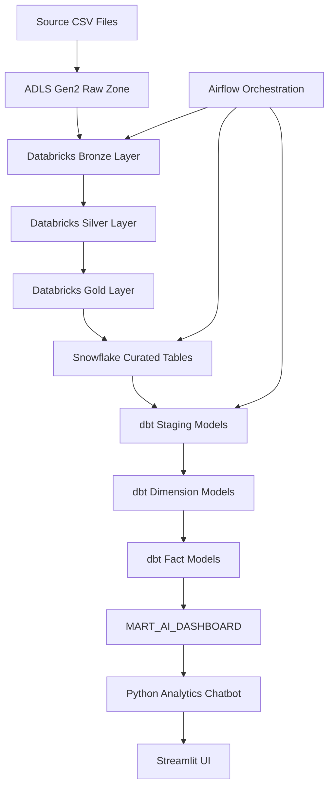
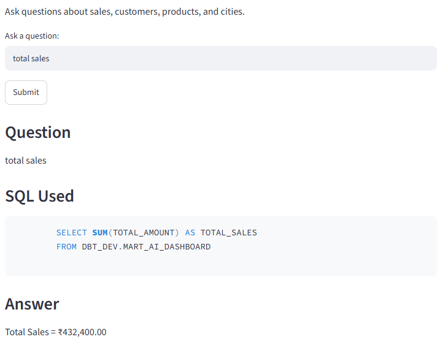
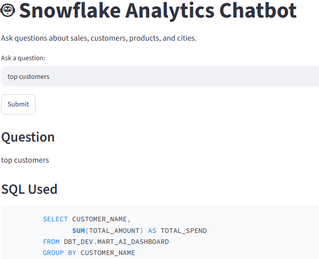

# 🚀 E-Commerce Analytics Chatbot Project

## 📌 Project Overview

This project demonstrates an end-to-end Data Engineering and Analytics platform using Azure Data Lake Storage Gen2 (ADLS), Azure Databricks, Snowflake, dbt, Apache Airflow, Python, and Streamlit.

The final solution is an Analytics Chatbot that enables business users to ask natural language questions and receive analytics insights directly from Snowflake.

### Sample Questions

* Total Sales
* Top Customer
* Top Product
* Total Orders
* Completed Orders
* City Wise Sales

### Chatbot Output

The chatbot displays:

* User Question
* SQL Query Used
* Business Answer

---

# ⭐ Project Highlights

* End-to-End Data Engineering Pipeline
* ADLS Gen2 → Databricks → Snowflake → dbt
* Streamlit Analytics Chatbot
* Airflow Orchestration
* SQL Transparency
* Snowflake Analytics Mart
* GitHub Version Controlled
* Interview Ready Project

---

# 🏗️ Architecture



---

# 🛠️ Technology Stack

| Layer           | Technology                   |
| --------------- | ---------------------------- |
| Storage         | Azure Data Lake Storage Gen2 |
| Processing      | Azure Databricks             |
| Data Warehouse  | Snowflake                    |
| Transformation  | dbt                          |
| Orchestration   | Apache Airflow               |
| Backend         | Python                       |
| Frontend        | Streamlit                    |
| Version Control | Git & GitHub                 |

---

Final Architecture
## 🏗️ Complete Architecture

```text
Source CSV Files
        │
        ▼
Azure Data Factory (ADF)
(Copy Activity)
        │
        ▼
ADLS Gen2
(Raw Zone)
        │
        ▼
Azure Databricks
(Bronze → Silver → Gold)
        │
        ▼
Snowflake
(Curated Tables)
        │
        ▼
dbt
(Staging → Dimensions → Facts → Marts)
        │
        ▼
MART_AI_DASHBOARD
        │
        ▼
Python Analytics Chatbot
        │
        ▼
Streamlit UI

──────────────────────────────

Airflow Orchestration

Databricks
      ↓
Snowflake Load
      ↓
dbt Run
      ↓
dbt Test
      ↓
Refresh MART_AI_DASHBOARD
```
# Technology Stack update
```text
| Layer          | Technology         |
| -------------- | ------------------ |
| Ingestion      | Azure Data Factory |
| Storage        | ADLS Gen2          |
| Processing     | Azure Databricks   |
| Data Warehouse | Snowflake          |
| Transformation | dbt                |
| Orchestration  | Apache Airflow     |
| Backend        | Python             |
| Frontend       | Streamlit          |

```

# Project Flow Explanation
```text
ADF
 ↓
ADLS Gen2
 ↓
Databricks
 ↓
Snowflake
 ↓
dbt
 ↓
MART_AI_DASHBOARD
 ↓
Python Chatbot
 ↓
Streamlit

```

Source files are ingested using Azure Data Factory into ADLS Gen2. Azure Databricks processes the data through Bronze, Silver, and Gold layers. Curated datasets are loaded into Snowflake. dbt creates dimensions, facts, and MART_AI_DASHBOARD. Apache Airflow orchestrates the workflow. A Python-based analytics chatbot reads data from MART_AI_DASHBOARD and exposes insights through a Streamlit UI.

Note:
ADF is included in the architecture as the ingestion layer to represent a production-grade Azure Data Engineering solution. Current implementation uses manually uploaded files, but can be extended with ADF Copy Activities and scheduled triggers.

# 📂 Repository Structure

```text
ecommerce-platform/
│
├── databricks/
│
├── snowflake/
│
├── airflow/
│   └── dags/
│       └── ecommerce_pipeline.py
│
├── dbt/
│   └── ecommerce_dbt/
│
├── powerbi/
│
├── ai-chatbot/
│   ├── app.py
│   ├── chatbot.py
│   ├── snowflake_connection.py
│   ├── streamlit_app.py
│   ├── execute_query.py
│   ├── text_to_sql.py
│   ├── requirements.txt
│   └── .env
│
├── screenshots/
│
├── README.md
│
└── .gitignore
```

---

# 📸 Application Screenshots

## Top Sales Dashboard

<p align="center">
  
</p>

## Top Customers Dashboard

<p align="center">
  
</p>

---

# 🔄 End-to-End Data Flow

## Step 1: Data Ingestion

Raw CSV files are uploaded to Azure Data Lake Storage Gen2.

Example files:

```text
orders.csv
customers.csv
products.csv
payments.csv
```

---

## Step 2: Databricks Processing

Databricks performs Bronze, Silver, and Gold transformations.

### Bronze Layer

* Raw data ingestion

### Silver Layer

* Null handling
* Duplicate removal
* Data validation
* Data standardization

### Gold Layer

* Business-ready datasets
* Optimized for analytics

---

## Step 3: Snowflake Loading

Curated datasets are loaded into Snowflake.

Example:

```sql
COPY INTO SALES_FACT
FROM @stage
FILE_FORMAT=(TYPE='CSV');
```

---

## Step 4: dbt Transformations

dbt creates:

### Staging Models

```text
stg_orders
stg_customers
stg_products
```

### Dimension Models

```text
dim_customer
dim_product
dim_date
```

### Fact Models

```text
fact_orders
```

### Mart Models

```text
MART_AI_DASHBOARD
```

---

# 📊 MART_AI_DASHBOARD

The chatbot reads data from:

```sql
SELECT *
FROM DBT_DEV.MART_AI_DASHBOARD;
```

### Sample Columns

| Column         |
| -------------- |
| ORDER_ID       |
| ORDER_DATE     |
| CUSTOMER_NAME  |
| CITY           |
| COUNTRY        |
| PRODUCT_NAME   |
| CATEGORY       |
| TOTAL_AMOUNT   |
| PAYMENT_STATUS |

---

# 🤖 Analytics Chatbot

## Chatbot Flow

```text
User Question
      ↓
chatbot.py
      ↓
Snowflake Query
      ↓
Business Logic
      ↓
SQL + Answer
```

---

## Supported Questions

### Total Sales

```text
total sales
```

### Top Customer

```text
top customer
```

### Top Product

```text
top product
```

### Total Orders

```text
total orders
```

### Completed Orders

```text
completed orders
```

### City Wise Sales

```text
city wise sales
```

---

# 🖥️ Streamlit Implementation

## Why Streamlit?

* Free
* Fast Development
* Interactive UI
* Easy Demonstrations

### Installation

```bash
pip install streamlit
```

### Run

```bash
streamlit run streamlit_app.py
```

### Output

* Question
* SQL Query
* Business Answer

---

# ⚙️ Airflow Implementation

## Why Airflow?

Without Airflow:

```text
Manual Execution
```

With Airflow:

```text
Scheduled Execution
```

### Workflow

```text
Databricks
     ↓
Snowflake Load
     ↓
dbt Run
     ↓
dbt Test
     ↓
Refresh MART_AI_DASHBOARD
```

### DAG Flow

```python
databricks_job
 >> snowflake_load
 >> dbt_run
 >> dbt_test
 >> refresh_dashboard
```

### Benefits

* Scheduling
* Monitoring
* Dependency Management
* Retry Mechanism
* Production Readiness

---

# ▶️ How To Run Project

## Clone Repository

```bash
git clone <repository-url>
```

## Create Virtual Environment

```bash
python -m venv env
```

## Activate Environment

```bash
env\Scripts\activate
```

## Install Packages

```bash
pip install -r requirements.txt
```

## Configure Snowflake Credentials

```env
USER=
PASSWORD=
ACCOUNT=
WAREHOUSE=
DATABASE=
SCHEMA=
```

## Verify Connection

```bash
python snowflake_connection.py
```

## Run Streamlit

```bash
streamlit run streamlit_app.py
```

## Open Browser

```text
http://localhost:8501
```

---

# 🧪 Sample Questions

```text
total sales
top customer
top product
total orders
completed orders
city wise sales
```

---

# 💼 Interview Explanation

Built an end-to-end analytics platform using ADLS Gen2, Databricks, Snowflake, dbt, Airflow, Python, and Streamlit.

Data is ingested into ADLS, transformed in Databricks, loaded into Snowflake, modeled through dbt, orchestrated by Airflow, and exposed through a Streamlit chatbot that provides business insights and displays SQL queries for transparency.

---

# 🎯 Interview Preparation

Topics covered in this project:

* Azure Data Lake Gen2
* Databricks
* Snowflake
* dbt
* Airflow
* Python
* Streamlit
* Data Warehousing
* ETL vs ELT
* Bronze / Silver / Gold Architecture
* Snowflake Time Travel
* Zero Copy Cloning
* Incremental Loading
* Data Modeling

---

# 🚀 Future Enhancements

* Dynamic Text-to-SQL
* Azure OpenAI Integration
* RAG Implementation
* Streamlit Visualizations
* Power BI Dashboards
* Docker Deployment
* CI/CD Pipeline
* Azure App Service Deployment

---

# 🏆 Key Learnings

* Data Lake Architecture
* Distributed Data Processing
* Cloud Data Warehousing
* Analytics Engineering with dbt
* Workflow Orchestration
* Python Development
* Dashboard Development
* End-to-End Data Engineering Best Practices


## 📊  🚀 E-Commerce Analytics Chatbot Project

# 📊 📌 Project Overview

This project demonstrates an end-to-end Data Engineering and Analytics platform using:

Azure Data Lake Storage Gen2 (ADLS)
Azure Databricks
Snowflake
dbt
Apache Airflow
Python
Streamlit

The final output is an Analytics Chatbot that allows business users to ask questions such as:

total sales
top customer
top product
completed orders
city wise sales

The chatbot reads data from Snowflake and displays:

User Question
SQL Query Used
Business Answer

## 📊 🏗️ Complete Architecture

```text
+-------------------+
| Source CSV Files  |
+-------------------+
          |
          v
+-------------------+
| ADLS Gen2         |
| Raw Zone          |
+-------------------+
          |
          v
+-------------------+
| Azure Databricks  |
| Bronze Layer      |
| Silver Layer      |
| Gold Layer        |
+-------------------+
          |
          v
+-------------------+
| Snowflake         |
| Curated Tables    |
+-------------------+
          |
          v
+-------------------+
| dbt Models        |
| Staging           |
| Dimensions        |
| Facts             |
| Marts             |
+-------------------+
          |
          v
+---------------------------+
| MART_AI_DASHBOARD         |
+---------------------------+
          |
          v
+-------------------+
| Python Chatbot    |
+-------------------+
          |
          v
+-------------------+
| Streamlit UI      |
+-------------------+
```

Airflow orchestrates the complete workflow

## 📊 📂 Repository Structure

```text
ecommerce-platform/
│
├── databricks/
│
├── snowflake/
│
├── airflow/
│   └── dags/
│       └── ecommerce_pipeline.py
│
├── dbt/
│   └── ecommerce_dbt/
│
├── powerbi/
│
├── ai-chatbot/
│   ├── app.py
│   ├── chatbot.py
│   ├── snowflake_connection.py
│   ├── streamlit_app.py
│   ├── execute_query.py
│   ├── text_to_sql.py
│   ├── requirements.txt
│   └── .env
│
├── README.md
│
└── .gitignore
```

## 📊 🔄 End-to-End Data Flow

Step 1: Data Ingestion

Raw CSV files are uploaded to:

Azure Data Lake Storage Gen2

Example:

orders.csv
customers.csv
products.csv
payments.csv
Step 2: Databricks Processing

Databricks performs:

Bronze Layer

Raw data ingestion.

Raw CSV → Bronze
Silver Layer

Data cleansing.

Null handling
Duplicates removal
Data validation
Gold Layer

Business-ready datasets.

Orders
Customers
Products
Payments
Step 3: Snowflake Loading

Curated data is loaded into Snowflake.

Example:

COPY INTO SALES_FACT
FROM @stage
FILE_FORMAT=(TYPE='CSV');
Step 4: dbt Transformations

dbt builds:

Staging Models
stg_orders
stg_customers
stg_products
Dimension Tables
dim_customer
dim_product
dim_date
Fact Tables
fact_orders
Mart Layer
MART_AI_DASHBOARD

## 📊 📊 MART_AI_DASHBOARD

The chatbot reads from:

SELECT *
FROM DBT_DEV.MART_AI_DASHBOARD

Sample columns:

Column
ORDER_ID
ORDER_DATE
CUSTOMER_NAME
CITY
COUNTRY
PRODUCT_NAME
CATEGORY
TOTAL_AMOUNT
PAYMENT_STATUS

## 📊 🤖 Analytics Chatbot

## 📊 Objective

## 📊 Allow users to ask business questions using natural language.


Example:
```text

total sales
Chatbot Flow
User Question
      |
      v
chatbot.py
      |
      v
Snowflake Data
      |
      v
Business Logic
      |
      v
SQL + Answer

```
Supported Questions
Total Sales
total sales

SQL:

SELECT SUM(TOTAL_AMOUNT)
FROM DBT_DEV.MART_AI_DASHBOARD;
Top Customer
top customer

SQL:

SELECT CUSTOMER_NAME,
       SUM(TOTAL_AMOUNT)
FROM DBT_DEV.MART_AI_DASHBOARD
GROUP BY CUSTOMER_NAME
ORDER BY 2 DESC
LIMIT 1;
Total Orders
total orders
Completed Orders
completed orders
Top Product
top product
City Wise Sales
city wise sales

## 📊 🖥️ Streamlit Implementation

Why Streamlit?

Provides a browser-based UI.

Benefits:

Free
Fast development
Interactive
Good for demos
Installation
pip install streamlit
Execution
streamlit run streamlit_app.py
Output

Displays:

Question

SQL Used

Answer

Example:

Question:
total sales

SQL:
SELECT SUM(TOTAL_AMOUNT)
FROM DBT_DEV.MART_AI_DASHBOARD

Answer:
₹432,400

## 📊 ⚙️ Airflow Implementation

Why Airflow?

Without Airflow:

Manual execution

With Airflow:

Scheduled execution
Workflow
```text
Databricks
     |
     v
Snowflake Load
     |
     v
dbt Run
     |
     v
dbt Test
     |
     v
Refresh MART_AI_DASHBOARD
```

DAG Design
databricks_job
 >> snowflake_load
 >> dbt_run
 >> dbt_test
 >> refresh_dashboard

Benefits
Scheduling
Daily
Hourly
Weekly
Dependency Management
Task A must finish
before Task B starts
Monitoring
Success
Failure
Retries

## 📊▶️ How To Run Project

Step 1

Clone repository

git clone <repo_url>
Step 2

Create virtual environment

python -m venv env
Step 3

Activate

env\Scripts\activate
Step 4

Install packages

pip install -r requirements.txt
Step 5

Configure Snowflake credentials

USER=
PASSWORD=
ACCOUNT=
WAREHOUSE=
DATABASE=
SCHEMA=
Step 6

Verify Snowflake

python snowflake_connection.py
Step 7

Start Streamlit

streamlit run streamlit_app.py
Step 8

## 📊 Open browser

http://localhost:8501

## 🧪 Sample Questions

total sales
top customer
top product
total orders
completed orders
city wise sales

## 📊💼 Interview Explanation

Developed an end-to-end Analytics Chatbot using Azure Data Lake Gen2, Databricks, Snowflake, dbt, Airflow, Python and Streamlit. Data is ingested into ADLS, transformed in Databricks, loaded into Snowflake, modeled using dbt, orchestrated through Airflow, and exposed through a Streamlit chatbot interface. The chatbot displays both SQL queries and business insights for transparency and validation.


## 📊 TOP SALES Dashboard

<p align="center">
  
</p>

## 📊 TOP CUSTOMERS Dashboard

<p align="center">
  
</p>


## 📊 🎯 Interview Questions & Answers

Q1. Explain the End-to-End Architecture of Your Project.

Answer

```text

Source Files
    ↓
ADLS Gen2
    ↓
Databricks
(Bronze → Silver → Gold)
    ↓
Snowflake
    ↓
dbt
    ↓
MART_AI_DASHBOARD
    ↓
Python Chatbot
    ↓
Streamlit UI

```
Airflow orchestrates the complete workflow.

## 📊 Azure Data Lake Gen2

Q2. Why did you use ADLS Gen2?
Answer

ADLS Gen2 provides:

Low-cost storage
Hierarchical namespace
Better performance
Integration with Databricks
Scalability

Used as the landing zone for raw files.

Q3. What is the difference between Blob Storage and ADLS Gen2?

Blob	ADLS Gen2
Object Storage	Data Lake
No HNS	HNS Supported
Limited Analytics	Big Data Analytics
Basic Permissions	Fine-Grained ACLs
Databricks

Q4. Why did you use Databricks?
Answer

Databricks was used for:

```text

Raw Data
   ↓
Bronze
   ↓
Silver
   ↓
Gold

```
Benefits:

Spark Engine
Distributed Processing
ETL Development
Data Quality

Q5. What is Bronze, Silver and Gold Architecture?
Bronze

Raw data.

Silver

Cleaned data.

Gold

Business-ready data.

Q6. How would you implement incremental loads?
Answer

Using:

Watermark columns
Modified date
Delta tables
MERGE statements

Example:

MERGE INTO target t
USING source s
ON t.id=s.id
WHEN MATCHED THEN UPDATE
WHEN NOT MATCHED THEN INSERT;
Snowflake

Q7. Why Snowflake?
Answer

Snowflake provides:

Separation of Storage and Compute
Auto Scaling
Time Travel
Zero Copy Cloning
High Performance

Q8. What is Virtual Warehouse?
Answer

A Virtual Warehouse is the compute engine responsible for:

Query execution
Data loading
Transformations

Storage and compute are independent.

Q9. Explain Snowflake Architecture.
Answer
Cloud Storage Layer
        ↓
Query Processing Layer
        ↓
Virtual Warehouse Layer

Q10. Difference Between Snowflake and Traditional Databases?
Traditional DB	Snowflake
Storage coupled with compute	Separate
Manual scaling	Auto scaling
Limited concurrency	High concurrency

Q11. What is Time Travel?
Answer

Allows recovery of historical data.

Example:

SELECT *
FROM orders
AT(OFFSET => -3600);

Q12. What is Zero Copy Cloning?
Answer

Creates a clone instantly without duplicating physical data.

Useful for:

Testing
Development
Backup
dbt

Q13. Why did you use dbt?
Answer

dbt was used for:

SQL transformations
Modular design
Documentation
Testing

Q14. Explain dbt Layers.

Answer

```text
Source
 ↓
Staging
 ↓
Dimensions
 ↓
Facts
 ↓
Marts

```
Q15. What dbt models did you create?
Answer

stg_orders
stg_customers
stg_products

dim_customer
dim_product

fact_orders

mart_ai_dashboard

Q16. Difference Between dbt run and dbt test?
dbt run

Builds models.

dbt test

Validates data quality.

Q17. What dbt tests have you implemented?
Answer
unique
not_null
accepted_values
relationships
Airflow

Q18. Why Airflow?

Answer

Airflow orchestrates:

```text
Databricks
 ↓
Snowflake
 ↓
dbt Run
 ↓
dbt Test
 ↓
Refresh Dashboard

```
Q19. What is a DAG?
Answer

DAG stands for:

Directed Acyclic Graph

Defines workflow execution order.

Q20. Explain Airflow Components.
Answer
Scheduler
Web Server
Executor
DAG
Operators

Q21. What Operators Did You Use?
Answer
BashOperator

Used to execute commands.

Python
Q22. How does the chatbot work?
Answer

Workflow:

```text
User Question
      ↓
chatbot.py
      ↓
Snowflake Query
      ↓
Business Logic
      ↓
Answer

```
Q23. Why use Pandas?
Answer

Used for:

Data analysis
Aggregations
Fast calculations

Q24. How do you connect to Snowflake?
Answer

Using:

snowflake.connector.connect()
Streamlit
Q25. Why Streamlit?
Answer

Provides:

Fast UI development
Browser-based access
Interactive analytics

Q26. How do you run Streamlit?
streamlit run streamlit_app.py
Project-Specific Questions

Q27. What table does the chatbot use?
Answer
DBT_DEV.MART_AI_DASHBOARD

Q28. Why create MART_AI_DASHBOARD?
Answer

Provides a single business-ready dataset for analytics queries.

Q29. How would you improve this project?
Answer
Dynamic SQL generation
Azure OpenAI Integration
RAG
Power BI dashboards
Docker deployment
CI/CD

Q30. Explain this project in 2 minutes.
Answer

Built an end-to-end analytics platform using ADLS Gen2, Databricks, Snowflake, dbt, Airflow, Python and Streamlit. Data is ingested into ADLS, transformed in Databricks, loaded into Snowflake, modeled through dbt, orchestrated by Airflow and exposed through a Streamlit chatbot that provides business insights and displays SQL queries for transparency.

| Feature | Databricks | dbt |
|----------|------------|-----|
| Purpose | Data Processing Platform | Data Transformation Tool |
| Language | PySpark, SQL, Python, Scala | SQL + Jinja |
| Compute Engine | Apache Spark | Uses Data Warehouse Compute |
| Handles Large Data | ✅ Yes (TBs/PBs) | ⚠️ Depends on Warehouse |
| ETL | Full ETL | Mainly ELT |
| Machine Learning | ✅ Yes | ❌ No |
| Streaming | ✅ Yes | ❌ No |
| Data Quality | Possible | Built-in Tests |
| Orchestration | Jobs / Workflows | Airflow or dbt Cloud |
| Best For | Complex Transformations | Analytics Modeling |
Think of Databricks as a factory.

It can:

Read files
Process TBs of data
Run Spark jobs
Perform ML
Handle Streaming
Create Delta Tables

Example:

df = spark.read.csv("/raw/orders.csv")

df_clean = df.dropDuplicates()

df_clean.write.saveAsTable("silver_orders")

Databricks is doing the heavy lifting.

dbt

Think of dbt as a business modeling layer.

It takes cleaned data and creates:

Dimensions
Facts
Marts
KPIs
Business Metrics

Example:

SELECT
    customer_id,
    SUM(total_amount) AS total_sales
FROM fact_orders
GROUP BY customer_id

dbt focuses on analytics and reporting.

In Your Project
Databricks Role:
```text
Raw CSV
    ↓
Bronze
    ↓
Silver
    ↓
Gold
```
Example tasks:

Remove duplicates
Handle nulls
Standardize data
Join large datasets
dbt Role
Gold Tables
      ↓
dim_customer
      ↓
dim_product
      ↓
fact_orders
      ↓
MART_AI_DASHBOARD

Example tasks:

Create business models
Define KPIs
Build marts
Data testing

Real Company Architecture:
```text
ADLS
  ↓
Databricks
  ↓
Snowflake
  ↓
dbt
  ↓
Power BI
```
Why Both?

Databricks:

Engineering Layer

dbt:

Analytics Layer
Interview Question
Q: Can dbt replace Databricks?
Answer

No.

dbt is excellent for:

SQL transformations
Data modeling
Testing
Documentation

But dbt cannot efficiently handle:

Large-scale Spark processing
Streaming
Machine Learning
Complex PySpark transformations
Q: Can Databricks replace dbt?
Answer

Technically yes, but not recommended.

You can create dimensions, facts, and marts in Databricks using SQL/PySpark.

However, dbt provides:

Modular SQL
Version control
Documentation
Lineage
Built-in testing

which makes analytics development much easier.

Best Interview Answer

Databricks and dbt serve different purposes. Databricks is used for large-scale data processing, ETL, streaming, and Spark-based transformations. dbt is used after the data is loaded into the warehouse to create business-friendly models such as dimensions, facts, and marts. In my project, Databricks processes raw data and loads curated data into Snowflake, while dbt builds the MART_AI_DASHBOARD consumed by the Streamlit analytics chatbot.

One-Line Memory Trick
Databricks = Data Engineering Layer
dbt        = Analytics Modeling Layer

In your project:

```text
ADLS
 ↓
Databricks  (Clean & Transform Data)
 ↓
Snowflake
 ↓
dbt         (Build Business Models)
 ↓
MART_AI_DASHBOARD
 ↓
Streamlit Chatbot
```